# Step 01: Azure Container Registryの構築

このステップでは、GitHub Actions Self-hosted Runner用のコンテナーイメージを格納するAzure Container Registry (ACR)を構築します。

## 学習目標

このステップを完了すると、以下を理解できます:

- Azure Container Registryの作成とPrivate Endpoint統合
- Microsoft公式イメージベースのRunnerコンテナーイメージのビルド
- ACRへのイメージプッシュとタグ管理
- 閉域環境でのコンテナーイメージ利用方法

## アーキテクチャ

### ACRを使用した閉域環境でのRunner実行

```
[事前準備フェーズ - インターネット接続環境]
ローカルマシン/ビルドサーバー
  ↓
Microsoft公式イメージベースでRunnerイメージをビルド
  ↓
ACRへプッシュ (一時的にパブリックアクセス有効化)
  ↓
パブリックアクセス無効化

[実行フェーズ - 閉域環境]
GitHub Actions Workflow
  ↓
Azure Container Instance作成
  ↓
ACR Private Endpoint経由でイメージをプル
  ↓
Runner起動・ジョブ実行
```

### このアプローチのメリット
- ✅ **セキュリティ**: 実行時にインターネットアクセス不要、完全閉域環境で動作
- ✅ **安定性**: 外部サービス依存なし、ネットワーク障害の影響を受けない
- ✅ **高速起動**: Private Endpoint経由の高速なイメージ取得
- ✅ **バージョン管理**: イメージタグで環境の再現性を確保

## 作成されるリソース

| リソース | 種類 | 目的 |
|---------|------|------|
| ACR | `Microsoft.ContainerRegistry/registries` | コンテナーイメージ格納 |
| Private Endpoint | `Microsoft.Network/privateEndpoints` | ACRへの閉域アクセス |
| Private DNS Zone | `privatelink.azurecr.io` | ACRのプライベート名前解決 |

## 前提条件

- [internal_rag_step_by_step](https://github.com/matakaha/internal_rag_step_by_step) Step 01が完了していること
- Virtual Network `vnet-internal-rag-<環境名>` が存在すること
- Azure CLI がインストールされていること

確認方法:
```powershell
# VNet確認
$RESOURCE_GROUP = "rg-internal-rag-dev"
$ENV_NAME = "dev"

az network vnet show `
  --resource-group $RESOURCE_GROUP `
  --name "vnet-internal-rag-$ENV_NAME"

# Azure CLI確認
az --version
```

## デプロイ手順

### 1. パラメータファイルの編集

`parameters.bicepparam` を開いて、環境に合わせて値を設定します:

```bicep
using './main.bicep'

param location = 'japaneast'
param environmentName = 'dev'
param acrName = 'acrinternalragdev'  // グローバルで一意な名前（小文字英数字のみ、5-50文字）
param vnetName = 'vnet-internal-rag-dev'
param privateEndpointSubnetName = 'snet-private-endpoints'
param enableAdminUser = false  // Managed Identity推奨、テスト時のみtrue
```

**重要**: 
- `acrName` はグローバルで一意である必要があります
- 小文字英数字のみ、5-50文字
- 例: `acrinternalrag<会社名><環境名>`

### 2. Azure Container Registryのデプロイ

```powershell
# Step 01ディレクトリに移動
cd bicep/step01-container-registry

# デプロイ実行
az deployment group create `
  --resource-group $RESOURCE_GROUP `
  --template-file main.bicep `
  --parameters parameters.bicepparam
```

**所要時間**: 約5-7分

### 3. ACR名の取得と環境変数設定

```powershell
# ACR名を環境変数に設定
$ACR_NAME = az deployment group show `
  --resource-group $RESOURCE_GROUP `
  --name main `
  --query properties.outputs.acrName.value `
  --output tsv

echo "ACR_NAME: $ACR_NAME"
```

### 4. Runnerコンテナーイメージのビルド

2つの方法があります:

- **方法1: ACR Tasks使用(推奨、Docker不要)** - クラウド上でビルド
- **方法2: ローカルDockerでビルド** - Docker Desktopが必要

#### 方法1: ACR Tasks使用(推奨)

**メリット**:
- ✅ ローカルにDockerのインストール不要
- ✅ クラウド上で高速ビルド
- ✅ ネットワーク帯域を消費しない

**手順**:

```powershell
# 1. パブリックアクセスとネットワークルールを一時的に許可（ACR Tasksに必要）
az acr update --name $ACR_NAME --public-network-enabled true --default-action Allow

# 2. ACR上で直接ビルドとプッシュを実行
az acr build `
  --registry $ACR_NAME `
  --image github-runner:latest `
  --image github-runner:1.0.0 `
  --file Dockerfile `
  .

# 3. イメージ確認（パブリックアクセス有効中に実施）
az acr repository show-tags `
  --name $ACR_NAME `
  --repository github-runner `
  --output table

# 4. パブリックアクセスとネットワークルールを無効化（セキュリティ強化）
az acr update --name $ACR_NAME --public-network-enabled false --default-action Deny
```

**所要時間**: 約3-5分

<details>
<summary>ACR Tasksの詳細説明</summary>

`az acr build` コマンドは以下を自動的に実行します:

1. ローカルのDockerfileとコンテキスト(カレントディレクトリ)をACRにアップロード
2. ACR上のビルドエージェントでDockerイメージをビルド
3. ビルドしたイメージをACRに自動プッシュ
4. ビルドログをリアルタイムで表示

> **⚠️ 注意**: ACR TasksのビルドエージェントはパブリックIPアドレスから接続するため、ビルド中は一時的に`publicNetworkAccess: Enabled`と`networkRuleSet.defaultAction: Allow`が必要です。ビルド完了後は必ず両方とも元の設定に戻してください。

</details>

---

#### 方法2: ローカルDockerでビルド(オプション)

**前提条件**: Docker Desktop または Podman がインストールされていること

```powershell
# Docker確認
docker --version
```

##### 4.1 Dockerfileの確認

`Dockerfile` がこのディレクトリに既に用意されています:

```dockerfile
# Microsoft公式のGitHub Actions Runnerイメージを使用
FROM mcr.microsoft.com/dotnet/runtime-deps:6.0

# 必要なパッケージのインストール
RUN apt-get update && apt-get install -y \
    curl \
    git \
    jq \
    wget \
    unzip \
    && rm -rf /var/lib/apt/lists/*

# Azure CLIのインストール
RUN curl -sL https://aka.ms/InstallAzureCLIDeb | bash

# GitHub Actions Runnerのダウンロードとインストール
ARG RUNNER_VERSION=2.311.0
WORKDIR /actions-runner
RUN curl -o actions-runner-linux-x64-${RUNNER_VERSION}.tar.gz \
    -L https://github.com/actions/runner/releases/download/v${RUNNER_VERSION}/actions-runner-linux-x64-${RUNNER_VERSION}.tar.gz \
    && tar xzf ./actions-runner-linux-x64-${RUNNER_VERSION}.tar.gz \
    && rm actions-runner-linux-x64-${RUNNER_VERSION}.tar.gz \
    && ./bin/installdependencies.sh

# 起動スクリプトをコピー
COPY start.sh /actions-runner/start.sh
RUN chmod +x /actions-runner/start.sh

# エントリーポイント
ENTRYPOINT ["/actions-runner/start.sh"]
```

**ポイント**:
- Microsoft公式の `.NET Runtime` イメージを使用
- Azure CLI をインストール（Azure リソース操作に必要）
- GitHub Actions Runner をインストール
- 起動時に自動でRunnerを登録

##### 4.2 起動スクリプトの確認

`start.sh` がこのディレクトリに既に用意されています:

```bash
#!/bin/bash
set -e

# 必須環境変数の確認
if [ -z "$GITHUB_TOKEN" ]; then
    echo "Error: GITHUB_TOKEN is not set"
    exit 1
fi

if [ -z "$GITHUB_REPOSITORY" ]; then
    echo "Error: GITHUB_REPOSITORY is not set"
    exit 1
fi

# Runner登録トークンの取得
REGISTRATION_TOKEN=$(curl -sX POST \
    -H "Authorization: token ${GITHUB_TOKEN}" \
    "https://api.github.com/repos/${GITHUB_REPOSITORY}/actions/runners/registration-token" \
    | jq -r .token)

# Runnerの設定
./config.sh \
    --url "https://github.com/${GITHUB_REPOSITORY}" \
    --token "${REGISTRATION_TOKEN}" \
    --name "azure-runner-$(hostname)" \
    --labels "azure,self-hosted" \
    --unattended \
    --ephemeral

# Runnerの起動
./run.sh
```

##### 4.3 パブリックアクセスの一時的な有効化

> **⚠️ 注意**: ローカルからACRにプッシュする場合のみ必要です。

```powershell
# パブリックアクセスを一時的に有効化
az acr update --name $ACR_NAME --public-network-enabled true
```

##### 4.4 イメージのビルドとプッシュ

```powershell
# ACRにログイン
az acr login --name $ACR_NAME

# イメージをビルド
docker build -t "${ACR_NAME}.azurecr.io/github-runner:latest" .

# イメージをACRにプッシュ
docker push "${ACR_NAME}.azurecr.io/github-runner:latest"

# タグ付き版もプッシュ（バージョン管理）
$VERSION = "1.0.0"
docker tag "${ACR_NAME}.azurecr.io/github-runner:latest" "${ACR_NAME}.azurecr.io/github-runner:${VERSION}"
docker push "${ACR_NAME}.azurecr.io/github-runner:${VERSION}"

# パブリックアクセスを無効化（セキュリティ強化）
az acr update --name $ACR_NAME --public-network-enabled false
```

**所要時間**: 約5-10分（初回ビルド）

</details>

---

### 5. イメージの確認

> **⚠️ 注意**: パブリックアクセス無効化後は、ローカルからのイメージ確認はできません。上記手順の「3. イメージ確認」で実施済みであることを確認してください。

パブリックアクセス無効化後に確認が必要な場合は、一時的に有効化してください:

```powershell
# 一時的にパブリックアクセスを有効化
az acr update --name $ACR_NAME --public-network-enabled true

# ACR内のイメージ一覧を表示
az acr repository list --name $ACR_NAME --output table

# 特定リポジトリのタグ一覧を表示
az acr repository show-tags --name $ACR_NAME --repository github-runner --output table

# 確認後、再度無効化
az acr update --name $ACR_NAME --public-network-enabled false
```

**期待される出力**:
```
Repository      Tag
--------------  -------
github-runner   latest
github-runner   1.0.0
```

## 詳細解説

### Azure Container Registry

#### SKUの選択

```bicep
sku: {
  name: 'Premium'  // Private Linkに必須
}
```

**SKU比較**:

| SKU | Private Link | Geo Replication | 料金/月 |
|-----|-------------|----------------|---------|
| Basic | ❌ | ❌ | ~¥600 |
| Standard | ❌ | ❌ | ~¥2,400 |
| **Premium** | ✅ | ✅ | ~¥6,000 |

**選択理由**: Private Endpoint利用にはPremium SKUが必須

#### パブリックアクセスの制御

```bicep
publicNetworkAccess: 'Disabled'  // Private Endpointのみ許可
```

**設定推奨**:
- **本番環境**: `Disabled` （完全閉域）
- **開発環境**: `Enabled` （ビルドマシンからのプッシュを許可）

> **Note**: `Disabled` の場合、ACRへのプッシュもPrivate Endpoint経由で行う必要があります

#### Admin Userの扱い

```bicep
adminUserEnabled: false  // Managed Identity推奨
```

**認証方法の比較**:

| 方法 | セキュリティ | 管理容易性 | 用途 |
|------|-------------|-----------|------|
| **Managed Identity** | ✅ 高 | ✅ 容易 | 本番環境推奨 |
| Admin User | ⚠️ 中 | △ パスワード管理必要 | テスト・開発のみ |
| Service Principal | ✅ 高 | △ 証明書管理必要 | CI/CD |

### Private Endpoint

#### Private DNS Zone統合

```bicep
privateDnsZoneGroup: {
  privateDnsZoneConfigs: [
    {
      name: 'config1'
      properties: {
        privateDnsZoneId: privateDnsZone.id
      }
    }
  ]
}
```

**動作**:
1. `<acrname>.azurecr.io` の名前解決が Private DNS Zone に転送
2. Private Endpoint の IP アドレスが返却
3. vNet内部からのアクセスが閉域で完結

#### Private Endpoint Subnet

```bicep
subnet: {
  id: resourceId('Microsoft.Network/virtualNetworks/subnets', vnetName, privateEndpointSubnetName)
}
```

**要件**:
- `privateEndpointNetworkPolicies` が `Disabled` であること
- 十分な空きIPアドレスがあること

### Dockerfileのベストプラクティス

#### Microsoft公式イメージの使用

```dockerfile
FROM mcr.microsoft.com/dotnet/runtime-deps:6.0
```

**理由**:
- ✅ Microsoft公式サポート
- ✅ セキュリティパッチの定期配信
- ✅ Azure環境との最適化

**代替案との比較**:

| ベースイメージ | メリット | デメリット |
|--------------|---------|-----------|
| **microsoft/dotnet** | 公式サポート、最適化 | サイズ大 |
| ubuntu:22.04 | 汎用性高い | セキュリティ管理が必要 |
| alpine | サイズ小 | 互換性問題の可能性 |

#### レイヤーキャッシュの活用

```dockerfile
# パッケージインストール（変更頻度低）
RUN apt-get update && apt-get install -y ...

# Runner ダウンロード（バージョン指定）
ARG RUNNER_VERSION=2.311.0
RUN curl -o actions-runner-linux-x64-${RUNNER_VERSION}.tar.gz ...

# 起動スクリプト（変更頻度高）
COPY start.sh /actions-runner/start.sh
```

**ポイント**:
- 変更頻度の低いレイヤーを上に配置
- `COPY` は最後に実行してキャッシュを最大限活用

## イメージバージョン管理

### タグ戦略

```powershell
# セマンティックバージョニング
docker tag ${ACR_NAME}.azurecr.io/github-runner:latest ${ACR_NAME}.azurecr.io/github-runner:1.0.0
docker tag ${ACR_NAME}.azurecr.io/github-runner:latest ${ACR_NAME}.azurecr.io/github-runner:1.0
docker tag ${ACR_NAME}.azurecr.io/github-runner:latest ${ACR_NAME}.azurecr.io/github-runner:1

# 日付ベース
$DATE = Get-Date -Format "yyyyMMdd"
docker tag ${ACR_NAME}.azurecr.io/github-runner:latest ${ACR_NAME}.azurecr.io/github-runner:${DATE}

# Git SHA（CI/CD環境）
docker tag ${ACR_NAME}.azurecr.io/github-runner:latest ${ACR_NAME}.azurecr.io/github-runner:${env:GITHUB_SHA}
```

**推奨戦略**:
- `latest`: 常に最新版（開発環境）
- `1.x.x`: セマンティックバージョニング（本番環境）
- `YYYYMMDD`: 日付ベース（変更追跡）

### イメージの更新フロー

```mermaid
graph LR
    A[Dockerfile修正] --> B[ローカルビルド]
    B --> C[テスト]
    C --> D{OK?}
    D -->|Yes| E[バージョンタグ付与]
    D -->|No| A
    E --> F[ACRへプッシュ]
    F --> G[Step03でタグ指定]
```



## 検証

### 1. ACR作成確認

```powershell
az acr show --name $ACR_NAME --query "{Name:name, Sku:sku.name, LoginServer:loginServer, PublicNetworkAccess:publicNetworkAccess}"
```

**期待される出力**:
```json
{
  "Name": "acrinternalragdev",
  "Sku": "Premium",
  "LoginServer": "acrinternalragdev.azurecr.io",
  "PublicNetworkAccess": "Disabled"
}
```

### 2. Private Endpoint確認

```powershell
az network private-endpoint show `
  --resource-group $RESOURCE_GROUP `
  --name "pe-acr-$ENV_NAME" `
  --query "{Name:name, PrivateIpAddress:customDnsConfigs[0].ipAddresses[0]}"
```

### 3. Private DNS Zone確認

```powershell
az network private-dns record-set a list `
  --resource-group $RESOURCE_GROUP `
  --zone-name "privatelink.azurecr.io" `
  --query "[].{Name:name, IPAddress:aRecords[0].ipv4Address}"
```

**期待される出力**:
```
Name                      IPAddress
------------------------  -----------
acrinternalragdev         10.0.1.x
acrinternalragdev.japaneast.data  10.0.1.y
```

### 4. vNet内からの疎通確認

```powershell
# Private Endpoint経由でACRにアクセス
az vm run-command invoke `
  --resource-group $RESOURCE_GROUP `
  --name <existing-vm-name> `
  --command-id RunShellScript `
  --scripts "nslookup ${ACR_NAME}.azurecr.io"
```

**期待される動作**: Private IP (10.0.1.x) が返却される

### 5. イメージプル確認

```powershell
# ACRからイメージをプル（ローカルでテスト）
az acr login --name $ACR_NAME
docker pull ${ACR_NAME}.azurecr.io/github-runner:latest

# イメージ詳細確認
docker inspect ${ACR_NAME}.azurecr.io/github-runner:latest
```

## トラブルシューティング

### エラー: ACR名が既に使用されている

**原因**: ACR名はグローバルで一意である必要がある

**対処法**:
```powershell
# 利用可能な名前か確認
az acr check-name --name <your-acr-name>

# 別の名前を試す
# 例: acrinternalrag<会社名><環境名>
```

### エラー: Private Endpoint作成に失敗

**原因**: Subnet の `privateEndpointNetworkPolicies` が有効

**対処法**:
```powershell
az network vnet subnet update `
  --resource-group $RESOURCE_GROUP `
  --vnet-name "vnet-internal-rag-$ENV_NAME" `
  --name snet-private-endpoints `
  --disable-private-endpoint-network-policies true
```

### エラー: ACRへのログインに失敗

**原因**: `publicNetworkAccess: Disabled` の場合、ローカルからアクセス不可

**対処法1: パブリックアクセスを一時的に有効化**:

```powershell
# パブリックアクセス有効化
az acr update --name $ACR_NAME --public-network-enabled true

# イメージ確認またはプッシュ
az acr repository show-tags --name $ACR_NAME --repository github-runner --output table

# パブリックアクセス無効化
az acr update --name $ACR_NAME --public-network-enabled false
```

**対処法2: Docker不要の認証 (Azure CLIのみ)**:

```powershell
# パブリックアクセス有効化
az acr update --name $ACR_NAME --public-network-enabled true

# Docker不要のログイン方法（トークン取得）
az acr login --name $ACR_NAME --expose-token

# パブリックアクセス無効化
az acr update --name $ACR_NAME --public-network-enabled false
```

> **💡 Note**: ACR Tasksを使用する場合、Dockerインストールは不要です。`az acr repository`コマンドでイメージ確認ができます。

### エラー: Dockerイメージのビルドに失敗

**原因**: ベースイメージのダウンロードに失敗

**対処法**:
```powershell
# プロキシ設定の確認
echo $env:HTTP_PROXY
echo $env:HTTPS_PROXY

# Docker Desktopの再起動
Restart-Service docker  # Windows Service版の場合
```

### イメージが大きすぎる場合

**原因**: 不要なパッケージやキャッシュが含まれている

**対処法**:
```dockerfile
# キャッシュクリア
RUN apt-get update && apt-get install -y \
    curl git jq \
    && rm -rf /var/lib/apt/lists/*  # ← キャッシュ削除

# マルチステージビルドの活用
FROM mcr.microsoft.com/dotnet/sdk:6.0 AS build
# ... ビルド処理 ...

FROM mcr.microsoft.com/dotnet/runtime-deps:6.0
COPY --from=build /app /app  # 必要なファイルのみコピー
```

## ベストプラクティス

### セキュリティ

- ✅ **Premium SKU使用**: Private Endpoint対応
- ✅ **パブリックアクセス無効化**: `publicNetworkAccess: Disabled`
- ✅ **Managed Identity推奨**: Admin User は避ける
- ✅ **定期的なイメージ更新**: セキュリティパッチ適用

### コスト最適化

- ✅ **不要イメージの削除**: 古いタグを定期削除
- ✅ **Geo Replication無効**: 単一リージョンで十分な場合
- ✅ **イメージサイズ最小化**: 不要なレイヤーを削減

### 運用管理

- ✅ **タグ戦略**: セマンティックバージョニング
- ✅ **イメージスキャン**: 脆弱性検出を有効化
- ✅ **ライフサイクルポリシー**: 古いイメージの自動削除

## 次のステップ

ACRとRunnerイメージが完成したら、次のステップに進みましょう:

- [Step 02: Container Instance Subnetの構築](../step02-runner-subnet/README.md)
- [Step 03: Key Vaultの構築](../step03-keyvault/README.md) - ACR認証情報の追加
- [Step 04: GitHub Actionsの設定](../step04-github-actions/README.md) - ACRイメージの利用
- [デプロイガイドに戻る](../../docs/deployment-guide.md)

## 参考リンク

- [Azure Container Registry ドキュメント](https://learn.microsoft.com/ja-jp/azure/container-registry/)
- [Private Linkを使用したACRへの接続](https://learn.microsoft.com/ja-jp/azure/container-registry/container-registry-private-link)
- [GitHub Actions Self-hosted Runners](https://docs.github.com/ja/actions/hosting-your-own-runners)
- [Dockerfile ベストプラクティス](https://docs.docker.com/develop/develop-images/dockerfile_best-practices/)
