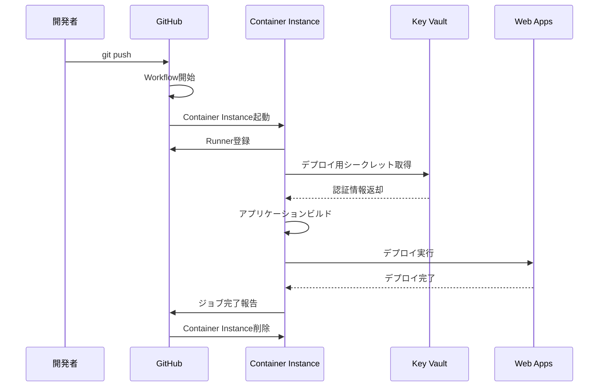

# アーキテクチャ概要

このドキュメントでは、GitHub ActionsでAzure閉域環境（vNet統合済Web Apps)へCI/CDデプロイする際のアーキテクチャについて説明します。

## 前提環境

このガイドは、[internal_rag_step_by_step](https://github.com/matakaha/internal_rag_step_by_step)で構築した以下の環境を前提としています:

### 既存のリソース

| リソース | 名前例 | 用途 |
|---------|-------|------|
| Virtual Network | `vnet-internal-rag-dev` | 閉域ネットワーク基盤 |
| Private Endpoint Subnet | `snet-private-endpoints` | Private Endpoint配置 |
| App Integration Subnet | `snet-app-integration` | Web Apps vNet統合 |
| Compute Subnet | `snet-compute` | 将来の拡張用 |
| Web Apps | `app-internal-rag-dev` | アプリケーション実行環境 |
| Private DNS Zones | 複数 | Private Endpoint名前解決 |

## CI/CDアーキテクチャ

### 概要図

```
┌─────────────────────────────────────────────────────────────────────────┐
│                    GitHub (パブリック環境)                               │
│                                                                          │
│  ┌──────────────────┐                                                   │
│  │  GitHub Actions  │                                                   │
│  │  Workflow        │                                                   │
│  └────────┬─────────┘                                                   │
│           │                                                              │
└───────────┼──────────────────────────────────────────────────────────────┘
            │
            │ 1. Runner起動リクエスト
            │
┌───────────▼──────────────────────────────────────────────────────────────┐
│               Azure Virtual Network (10.0.0.0/16)                        │
│                                                                           │
│  ┌──────────────────────────────────────────────────────────┐       │
│  │          Container Instance Subnet (10.0.6.0/24)             │       │
│  │                                                                │       │
│  │  ┌─────────────────────────────────────────────────────┐    │       │
│  │  │  Azure Container Instance                           │    │       │
│  │  │  (Self-hosted GitHub Actions Runner)                │    │       │
│  │  │                                                       │    │       │
│  │  │  - GitHub Runner登録                                │    │       │
│  │  │  - Key Vaultからシークレット取得                    │    │       │
│  │  │  - アプリケーションビルド                            │    │       │
│  │  │  - Web Appsへデプロイ                               │    │       │
│  │  └───────────┬─────────────────────────────────────────┘    │       │
│  │              │                                                │       │
│  └──────────────┼────────────────────────────────────────────────┘       │
│                 │                                                         │
│                 │ 2. シークレット取得                                     │
│                 │                                                         │
│  ┌──────────────▼─────────────┐     ┌────────────────────────┐         │
│  │      Key Vault             │     │      Web Apps          │         │
│  │                            │     │  (vNet統合済)          │         │
│  │  - デプロイ用認証情報      │     │                        │         │
│  │  - 接続文字列              │     │  - アプリ実行          │         │
│  │  - APIキー                 │     │  - Private Endpoint    │         │
│  │                            │     │    経由でアクセス      │         │
│  │  Private Endpoint          │     │                        │         │
│  └────────────────────────────┘     └───────────┬────────────┘         │
│                 ▲                                │                       │
│                 │                                │ 3. デプロイ           │
│                 │                                │                       │
│  ┌──────────────┴────────────────────────────────▼─────────────┐       │
│  │            Private Endpoint Subnet (10.0.1.0/24)            │       │
│  │                                                               │       │
│  │  - Key Vault Private Endpoint                                │       │
│  │  - その他サービスのPrivate Endpoint                          │       │
│  └───────────────────────────────────────────────────────────────┘       │
│                                                                           │
│  ┌───────────────────────────────────────────────────────────────┐       │
│  │         App Integration Subnet (10.0.2.0/24)                 │       │
│  │         (Web Apps vNet統合)                                   │       │
│  └───────────────────────────────────────────────────────────────┘       │
│                                                                           │
└───────────────────────────────────────────────────────────────────────────┘
```

## デプロイフロー

### 1. Workflow起動



### 2. 詳細ステップ

#### Step 1: Workflow起動トリガー
- `git push` または手動トリガー
- GitHub Actionsワークフローが起動

#### Step 2: Container Instance起動
- Azure CLIでContainer Instance作成
- vNet統合済サブネットに配置
- GitHub Runnerをインストール・登録

#### Step 3: シークレット取得
- Container InstanceからKey Vaultへアクセス（Private Endpoint経由）
- デプロイに必要な認証情報を取得
- 環境変数として設定

#### Step 4: ビルド・デプロイ
- アプリケーションのビルド
- Web Appsへのデプロイ（vNet経由）
- デプロイ完了確認

#### Step 5: クリーンアップ
- ジョブ完了後、Container Instanceを削除
- コスト最適化

## コンポーネント詳細

### Container Instance Subnet (新規追加)

#### 概要
- **アドレス範囲**: 10.0.6.0/24
- **用途**: Self-hosted GitHub Actions Runnerの実行環境
- **特徴**: 都度起動・削除でコスト最適化

#### セキュリティ
- NSGでアクセス制御
- vNet内部からのみアクセス可能
- パブリックIPなし

### Key Vault

#### 概要
- **目的**: デプロイ用認証情報の安全な管理
- **アクセス**: Private Endpoint経由のみ
- **認証**: マネージドID

#### 格納する情報
- Web Appsデプロイ用サービスプリンシパル
- 接続文字列
- APIキー
- その他シークレット

#### アクセス制御
- Container InstanceのマネージドIDに権限付与
- 最小権限の原則を適用
- アクセスログ監視

### Self-hosted Runner

#### 選択理由
- vNet内リソースへの直接アクセスが必要
- GitHub ホステッドRunnerではPrivate Endpointへアクセス不可
- セキュリティ要件を満たすため

#### 実装方式
- **Container Instance**: 都度起動・削除
- **メリット**: 
  - コスト効率が良い（使用時のみ課金）
  - 最新の環境を毎回構築
  - メンテナンス不要
- **デメリット**:
  - 起動時間がかかる（約2-3分）

#### 代替案との比較

| 方式 | メリット | デメリット | コスト |
|------|---------|-----------|--------|
| **Container Instance** | 都度起動、最新環境 | 起動遅い | ¥1,000〜3,000/月 |
| VM (常時起動) | 高速起動 | 常時課金、メンテナンス必要 | ¥10,000〜/月 |
| Azure DevOps Agent | Azure統合良好 | GitHub Actions使えない | - |

## セキュリティ設計

### ネットワークセキュリティ

#### Private Endpoint
- すべての通信をvNet内に閉じ込め
- パブリックアクセス無効化
- Private DNS Zone統合

#### NSG
- サブネットごとに適切な制御
- 最小権限の原則
- ログ監視

### 認証・認可

#### マネージドID
- Container InstanceにシステムマネージドID付与
- Key VaultへのアクセスはマネージドIDで認証
- パスワード不要

#### サービスプリンシパル
- Web Appsデプロイ用
- Key Vaultで安全に管理
- 定期的なローテーション推奨

### シークレット管理

#### Key Vault
- すべてのシークレットをKey Vaultで一元管理
- アクセス監査ログ有効化
- 自動ローテーション機能の活用

#### GitHub Secrets
- Key Vault接続情報のみ格納
- 環境ごとに分離
- 最小限の情報のみ

## 運用設計

### デプロイ頻度

- **開発環境**: 1日数回〜数十回
- **Container Instance**: 使用時のみ起動でコスト最適化
- **想定起動時間**: デプロイあたり5〜10分

### モニタリング

#### Container Instance
- Azure Monitorでログ収集
- デプロイ成功/失敗の追跡
- リソース使用状況監視

#### Key Vault
- アクセスログ監視
- 異常なアクセスパターン検知
- 監査証跡の保持

#### Web Apps
- Application Insights統合
- デプロイ履歴追跡
- パフォーマンス監視

### コスト最適化

#### Container Instance
- ジョブ完了後即座に削除
- 適切なリソースサイズ選定
- 同時実行数の制御

#### Key Vault
- Standard SKU使用
- 不要なシークレットの定期削除
- アクセス頻度の監視

## 拡張性

### 複数環境対応

```
├── Dev環境
│   ├── Container Instance
│   ├── Key Vault (dev)
│   └── Web Apps (dev)
├── Staging環境
│   ├── Container Instance
│   ├── Key Vault (stg)
│   └── Web Apps (stg)
└── Production環境
    ├── Container Instance
    ├── Key Vault (prod)
    └── Web Apps (prod)
```

### スケーリング

- Runner並列実行数の調整
- Container Instanceリソースサイズ変更
- vNetアドレス範囲の拡張

## ベストプラクティス

### Infrastructure as Code
- すべてのインフラをBicepで管理
- バージョン管理
- 環境ごとのパラメータ分離

### GitOps
- main/developブランチ保護
- Pull Requestによるレビュー
- 自動テスト実行

### セキュリティ
- 最小権限の原則
- シークレットのローテーション
- 監査ログの保持

### コスト管理
- 不要なリソースの削除
- 適切なSKU選定
- コストアラート設定

## 次のステップ

アーキテクチャを理解したら、実際にデプロイを開始しましょう:

- [デプロイガイド](deployment-guide.md)
- [Step 01: Container Instance Subnet追加](../bicep/step01-runner-subnet/README.md)
